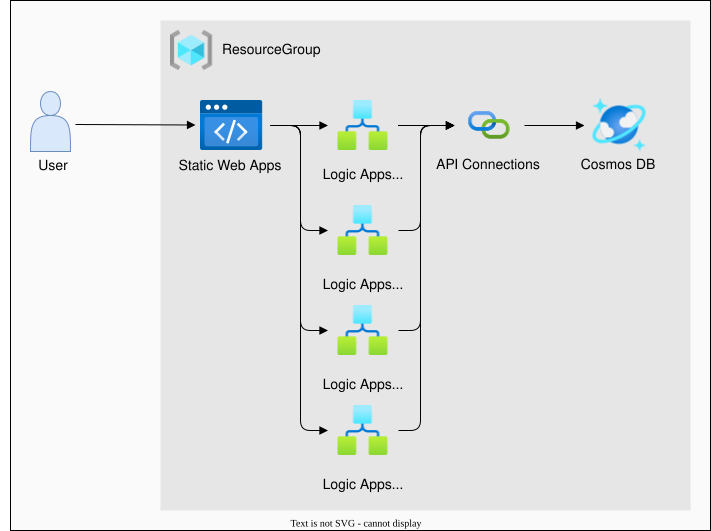
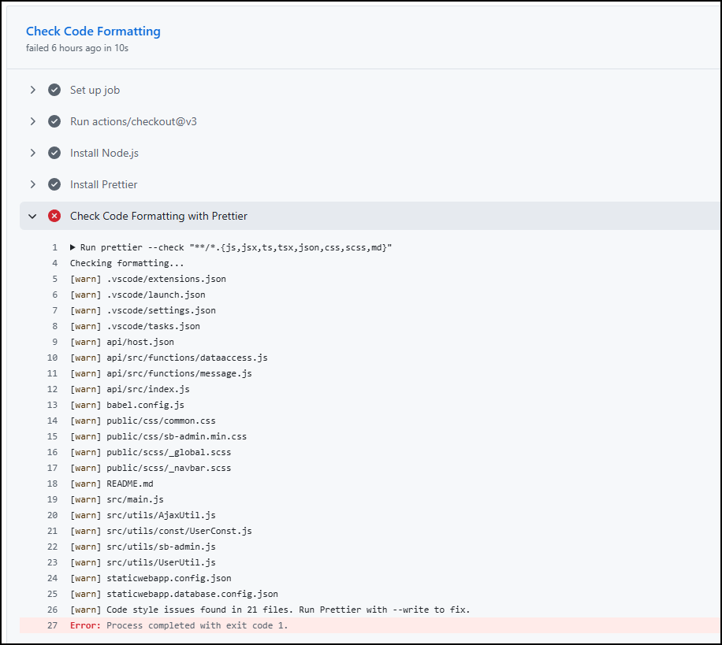
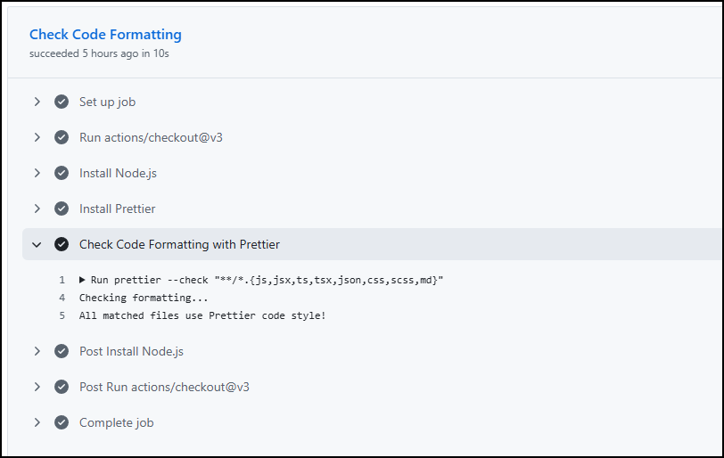
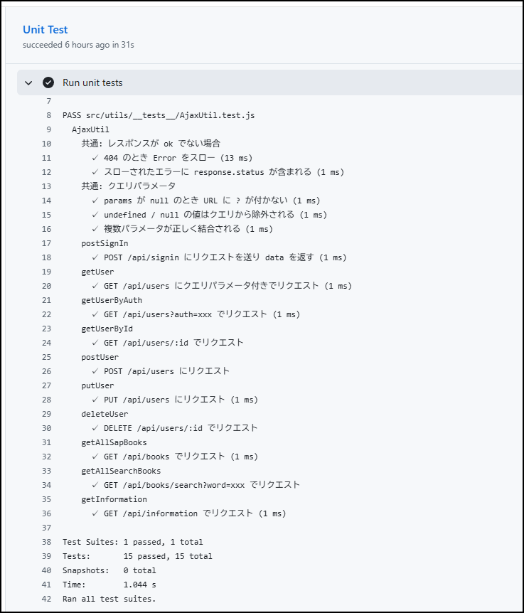

# CICD勉強会

* まえがき  
プロジェクトなどでほとんど触れることのないCICDパイプラインの実装や処理内容を理解するための勉強会。  
BookStation（Webアプリ）をAzureでデプロイする際のCICDパイプラインを実装します。（コードフォーマット確認と単体試験の実装）  
※新規作成からWebアプリケーションのデプロイまでの最低限の作成方法は、別の学習記事で記載済みなので、そちらを参照してください。（[CICD構成の作り方](https://github.com/KotaNakase/AzureStaticWebApps-knowledge)）

## 成果物
今回作成した成果物は以下の通りです。  
CICDの実装や仕組み自体はymlにすべて記載されています。

```
AzureStaticWebApps-BookStation/
└── github/
    ├── workflows/
    │   └── azure-static-web-apps-mango-river-03a6bc500.yml     # CICDを構成する設定ファイル
    ├── node_modules
    ├── public                                                  # Webアプリの実装部分
    ├── src                                                     # Webアプリの実装部分
    └── :
```

また、本学習と関連はありませんがWebアプリの構成は以下の通りです。  
ローカル環境に資材を配置せず、クラウド上で完結させています。  
[WebアプリケーションURL](https://mango-river-03a6bc500.4.azurestaticapps.net)




## CICD実装手順
今回作成したジョブは、最も基本的なジョブである「**コードフォーマットチェック**」と「**単体試験**」になります。それぞれ章ごとに作り方を記載しています。

### コードフォーマット確認
**コードフォーマット確認**ジョブでの最終的なymlは以下の通りです。

**/AzureStaticWebApps-BookStation/.github/workflows/azure-static-web-apps-mango-river-03a6bc500.yml**
```yml
jobs:
  check_codeFormatting_job:                                 # ジョブ名（yml内での定義名）
    runs-on: ubuntu-latest                                  # ジョブの実行環境の指定（Linuxを指定）
    name: Check Code Formatting Job                         # ジョブ名（GitHubで確認可能）
    steps:
      - uses: actions/checkout@v3                           # デプロイ対象のリポジトリのチェックアウトを実施
      - name: Install Node.js                               # 次ステップ名（GitHubで確認可能）
        uses: actions/setup-node@v3                         # ジョブの実行環境にNode.jsをインストール
        with:
          node-version: '16'                                # インストールするNode.jsのバージョンを指定
      - name: Install Prettier                              # 次ステップ名（GitHubで確認可能）
        run: npm install --global prettier                  # コードフォーマッター（prettier）をインストール
      - name: Check Code Formatting with Prettier           # 次ステップ名（GitHubで確認可能）
        run: prettier --check "**/*.{js,json,css,scss}"     # ソースコードがフォーマットされているか確認（修正はしない）
```

### 各項目の解説
* `runs-on: ubuntu-latest`  
本ジョブを実行する環境の指定をします。様々選べますが、今回はLinux（ubuntu）を選択します。

* `uses: actions/checkout@v3`  
実行環境に対してデプロイ対象のリポジトリをチェックアウトします。  
※直前の処理で生成したばかりの環境なので、まだ空の状態なのでソースコードやモジュールを準備する必要があります。

* `uses: actions/setup-node@v3`  
実行環境に対してNode.jsをインストールします。  
※こちらも同様に、ジョブで処理をさせるための準備作業になります。  

* `with: node-version: '16'`  
Node.jsのバージョン指定になります。インストールアクションの直後に`with`を記載してアクションに引数（バージョン）を渡します。

* `run: npm install --global prettier`  
実行環境にコードフォーマッター（prettier）をインストールします。この後のコマンドでprettierを使用します。

* `run: prettier --check "**/*.{js,json,css,scss}"`  
対象のソースに対して、コードフォーマットに順守しているかどうか確認します。  
※`prettier --check` はファイルを**書き換えずに確認のみ**行います。違反があった場合はジョブが失敗し、後続の `build_and_deploy_job` はブロックされます。

※`@3`などの記載はGitHubが用意した公式のアクションになります。  
[checkoutアクションのGithubリポジトリ](https://github.com/actions/checkout)

実際にデプロイを実施した時の表示は以下のようになります。  
フォーマットに違反があった場合には、それらがわかるようになっています。



フォーマット修正後のジョブは以下の通りです。きちんとジョブが成功していることがわかります。




### 単体試験
**単体試験**ジョブでの最終的なymlは以下の通りです。

**/AzureStaticWebApps-BookStation/.github/workflows/azure-static-web-apps-mango-river-03a6bc500.yml**
```yml
jobs:
  unit_test_job:                        # ジョブ名（yml内での定義名）
    runs-on: ubuntu-latest              # ジョブの実行環境の指定（Linuxを指定）
    name: Unit Test Job                 # ジョブ名（GitHubで確認可能）
    steps:
      - uses: actions/checkout@v3       # デプロイ対象のリポジトリのチェックアウトを実施
      - name: Install Node.js           # 次ステップ名（GitHubで確認可能）
        uses: actions/setup-node@v3     # ジョブの実行環境にNode.jsをインストール
        with:
          node-version: '16'            # インストールするNode.jsのバージョンを指定
      - name: Install dependencies      # 次ステップ名（GitHubで確認可能）
        run: npm ci                     # node_modulesをインストール
      - name: Run unit tests            # 次ステップ名（GitHubで確認可能）
        run: npm test                   # package.jsonに定義されたスクリプト「test」を実行
```

### 各項目の解説
* `runs-on: ubuntu-latest`  
本ジョブを実行する環境の指定をします。様々選べますが、今回はLinux（ubuntu）を選択します。

* `uses: actions/checkout@v3`  
実行環境に対してデプロイ対象のリポジトリをチェックアウトします。  
※直前の処理で生成したばかりの環境なので、まだ空の状態なのでソースコードやモジュールを準備する必要があります。

* `uses: actions/setup-node@v3`  
実行環境に対してNode.jsをインストールします。  
※こちらも同様に、ジョブで処理をさせるための準備作業になります。  

* `with: node-version: '16'`  
Node.jsのバージョン指定になります。インストールアクションの直後に`with`を記載してアクションに引数（バージョン）を渡します。

* `npm ci`  
`package-lock.json`に記載された**厳密なバージョン**で依存パッケージをインストールします。  
※`npm install` と異なり、lockファイルと差異があるとエラーになるためCI環境向き。←勉強中。

* `npm test`  
package.jsonに定義したスクリプトを実行します。定義内容は、`jest`を実行するというものになっています。  
**/AzureStaticWebApps-BookStation/package.json**
    ```json
    {
    "scripts": {
        "start": "serve -s dist",
        "serve": "vue-cli-service serve",
        "build": "vue-cli-service build",
        "lint": "vue-cli-service lint",
        "test": "jest"                      // これを実行
    },
    }
    ```

単体試験ジョブ実行結果は以下の通りです。テストの実施内容ごとにきちんとログが出力されていることがわかります。




### 付録（以下はデフォルトで生成されたreadmeの内容）
[Azure Static Web Apps](https://docs.microsoft.com/azure/static-web-apps/overview) allows you to easily build [Vue.js](https://vuejs.org/) apps in minutes. Use this repo with the [Vue quickstart](https://docs.microsoft.com/azure/static-web-apps/getting-started?tabs=vue) to build and customize a new static site.

### Project setup

```bash
npm install
```

#### Compiles and hot-reloads for development

```bash
npm run serve
```

#### Compiles and minifies for production

```bash
npm run build
```

#### Lints and fixes files

```bash
npm run lint
```

#### Customize configuration

See [Configuration Reference](https://cli.vuejs.org/config/).
